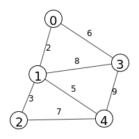
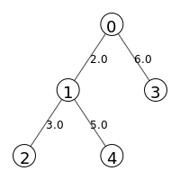
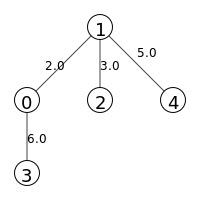
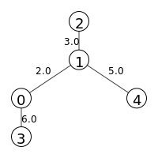
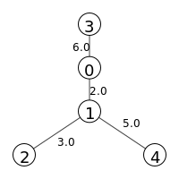

# Undirected Graph Algorithms

This depository contains some code I wrote for the course "[C++ For C Programmers, Part A](https://www.coursera.org/learn/c-plus-plus-a)" delivered by the University of California Santa Cruz on Coursera.

The purpose is to run algorithms on undirected graphs.  
Currently implemented algorithms are:
* Dijkstra's shortest path algorithm  
 It is possible to run Monte-Carlo simulation to compute an estimate of the expected shortest path length (number of nodes in the path) and an estimate of the expected shortest path cost (sum of the weights of the edges that form the path).
* Dijkstra-Jarnik-Prim's algorithm (also known as Prim's algorithm) for computing the minimum spanning tree of a connected graph.

To Do:
* Implement Bellman-Ford algorithm *(in shortestpath.h)*
* Implement Kruskal's algorithm *(in mst.h)*

## Compilation

### Clean
```bash
make clean
```
### Build
```bash
make
```
Preprocessor flags defined in Makefile:  
* _SHOW_EDGES is used to list all edges between nodes.  
* _PRINT_MATRIX is used to print the connectivity matrix (where the abscence of edge between two nodes `i` and `j` is indicated by the value `inf` at position `(i,j)` and `(j,i)`.) You need to install [Eigen](https://eigen.tuxfamily.org/index.php?title=Main_Page) for this.
* _DEBUG_MC can be used for tracing Monte-Carlo simulations
* _TRACE_MST is used to trace Minimum Spanning Tree algorithm
* _TEST_RANDOM_GRAPH to enable testing random graph in main.cpp
* _TEST_DIJKTRA to enable testing Dijkstra algorithm in main.cpp
* _TEST_SHORTEST_PATH_MONTE_CARLO to enable running MC simulation for shortested path in main.cpp
* _TEST_MST to enable testing Minimum Spanning Tree algorithm in main.cpp

## Usage

```bash
./spmc
```

## Examples of results
### <span style="color:lime">Monte-Carlo simulation for shortest path</span>
Below are results obtained when running a Monte-Carlo simulation for estimating the expected shortest path length and cost of a random undirected graph using Dijkstra algorithm.  
Graphs of size 50 were used with density of 0.2 and of 0.4 respectively. The range for the edges' weights is [1.0, 10.0].  
Each test ran 100 simulations in parallele using 4 threads.

```
Monte Carlo simulation for the estimation of the expected path length
 (path length = sum of edges' weight)
Graph size: 50
density: 0.2
Number of run (Optional just press enter to get the default value of 100):

The number of threads is set to 4.
(press enter if you dont want to change it.
Else enter the number of threads you want)

Run simulation with 4 threads
Duration : 27 s 325592 us

Estimation of the mean number of hop in a shortest path: 3.62242
Estimation of the mean distance estimation: 7.0165
Estimation of the variance of the mean distance: 0.0461961
```

```
Monte Carlo simulation for the estimation of the expected path length
 (path length = sum of edges' weight)
Graph size: 50
density: 0.4
Number of run (Optional just press enter to get the default value of 100):

The number of threads is set to 4.
(press enter if you don't want to change it.
Else enter the number of threads you want)

Run simulation with 4 threads
Duration : 31 s 547599 us

Estimation of the mean number of hop in a shortest path: 3.28749
Estimation of the mean distance estimation: 4.70316
Estimation of the variance of the mean distance: 0.0251515

```

### <span style="color:lime">Minimum Spanning Tree</span>
An example on how to run the Prim's algorithm on an undirect graph can be seen in main.cpp.  
Below is the result when the test is performed on the graph described in file `mst_test.txt` that can be found in the `Test` directory.  
The graph looks like this:  
  
And the minimum spanning trees obtained taking node 0, 1, 2, 3 and 4 as root respectively are these:  
*(one can see that as expected the sum of weights is always the same)*  




  

## Code details
The C++ code is splitted in four files:

* <span style="color:lime">graph.h</span>
* <span style="color:lime">shortestpath.h</span>
* <span style="color:lime">montecarlo.h</span>
* <span style="color:lime">shortestpathmontecarlo.h</span>
* <span style="color:lime">dfs.h</span>
* <span style="color:lime">mst.h</span>
* <span style="color:lime">trace.h</span>
* <span style="color:lime">main.cpp</span>

There is also a `Tools` directory with some tools in Python for plotting graphs and trees (Python igraph needs to be installed to be able to use these tools).  
The Test directory contains text files describing graphs. These files' path can be passed to Graph to initialized a graph (see an example on how to do that in main.cpp).

Code for *(random)* undirected graph is in `graph.h`.  
The algorithms for shortest path are implemented in `shortestpath.h`.  
`montecarlo.h` defines the generic interface for running Monte-Carlo simulation.  
`shortestpathmontecarlo.h` implements the Monte-carlo simulation for shortest path algorithms.  
The algorithms for Depth First Search can be found in `dfs.h`.
In `mst.h` is the code for building Minimum Spanning Trees from undirected connected graphs.  
In `trace.h` a simple class for tracing is defined *(it is used in mst.h.)*.  
`main.cpp` just shows examples on how to run the algorithms and the Monte-carlo simulation.

Let's detail the content of each files.  


> Note: since I prefer to have the public elements of a class at the beginning of the class I use "struct" keyword instead of "class".

---
### <span style="color:lime">graph.h</span>

This file contains all the definitions needed for undirected graphs:  
* `struct Node`
* `struct Edge`
* `struct Graph`
* `struct RandomGraph: Graph`

`struct Nodes` defines the vertices of a graph.
A node that belongs to a graph is located in the graph by its id, an unsigned integer that is use to index an array. It can also have a value assigned by an algorithm using the graph.  
The '<<' operator is overloaded to print node's information.  
The comparison operator '>' is overloaded such that the node can be stored in a priority queue ordered according to the node's value given by the algorithm running on the graph.

`struct Edge` defines the edges of the graph.  
An edge has an index that uniquely identifies the two nodes that can be linked by the edge (see below).  
An edge has a weight which is set to ***infinity*** (`std::numeric_limits<double>::infinity()`) when there is no edge between the two nodes.  
The '<<' operator is overloaded to print edge's information.  

`struct Graph` defines an undirected (weighted) graph.  
The copy constructor and assignment are deleted so that we don't fill the memory with copy of a graph on which instances of an algorithm would run in parallel.  
To save memory, only the lower half of the connectivity matrix is stored as an array. If an edge exists between two nodes then the weight of that edge is store in the array at the index uniquely identifying that edge *(otherwise, **infinity** is stored)*.  
For example, the below connectivity matrix **M** of an undirected graph of size 5 (with no node connected to itself)  

|   | node 0 | node 1 | node 2 | node 3 | node 4 |
| :--------| :--------| :--------| :--------| :--------| :--------|
| **node 0** |inf  |2   |inf |6    |5  |  
| **node 1** |2    |inf |1   |inf  |9  |
| **node 2** |inf  |1   |inf |3    |inf|  
| **node 3** |6    |inf |3   |inf  |inf|  
| **node 4** |5    |9   |inf |inf  |inf|

would be stored in an array as:  
`weights = [M(1,0), M(2,0), M(2,1), M(3,0), M(3,1), M(3,2), M(4,0), M(4,1), M(4,2), M(4,3)]`  
That is:  
`weights = [2, inf, 1, 6, inf, 3, 5, 9, inf, inf]`

For a node `i` and a node `j` how is computed the index in the array of the edge between these two nodes?  
Well, it's pretty simple:
* swap `i` and `j` if `i < j` (because we consider only the lower triangular part of the connectivity matrix)
* index `k` is equal to <!-- $\frac{i(i-1)}{2} + j$ -->   
**Proof**:   
For a square matrix of size `2` elements of the lower triangular part can indexed this way:  
0  
For a square matrix of size `3` elements of the lower triangular part can indexed this way:  
0  
1 &nbsp; 2    
For a square matrix of size `4` elements of the lower triangular part can indexed this way:  
0  
1 &nbsp; 2  
3 &nbsp; 4 &nbsp; 5   
So, on row `i=0` we have `T(0)=1` entry. If `T(i)` is the number of entry on row `i` then the number of entries on row `i+1` is `T(i+1) = T(i) + 1`. Hence, the number of entry on row `l` is `l+1`. If we index the entries as shown above, then the index at the beginning of row `i` `(i>0)` will be the sum of number of entries from row `0` to row `i-1`, i.e. <!-- $\sum_{l=0}^{i-1}(l+1) = \sum_{l=1}^{i}{l} = \frac{i(i-1)}{2}$ --> .  
Therefore the index at column `j` of row `i` is <!-- $\frac{i(i-1)}{2} + j$ --> .

So, in the previous example, the edge between node 4 and 1 is found in the array at index <!-- $\frac{4(4-1)}{2} + 1 = 7$ --> . The weight for this edge is `weights[7] = 9`.

In the opposite direction, having an index `k` for the array of edges weights, how can we find the 2 nodes, `i` and `j`, that are linked by this edge?  
Well, we know that <!-- $\space k = \frac{i(i-1)}{2} + j \space$ with $\space 0\le j<i$ -->  *(swap `i` and `j` if needed)*.  

So, we have <!-- $\frac{i(i-1)}{2} \le k < \frac{i(i-1)}{2} + i$ --> .  

Solving <!-- $\space k = \frac{i(i-1)}{2} \space $ -->  gives <!-- $\space i = \frac{-1+\sqrt{1+8k}}{2}$ -->   

And solving <!-- $\space k = \frac{i(i-1)}{2} + i \space $ -->  gives <!-- $\space i = \frac{1+\sqrt{1+8k}}{2}$ -->   
   
Therefore, <!-- $\frac{-1+\sqrt{1+8k}}{2} < i \le \frac{1+\sqrt{1+8k}}{2}$ -->  , or again, <!-- $\frac{\sqrt{1+8k}}{2} - \frac{1}{2} < i \le \frac{\sqrt{1+8k}}{2} + \frac{1}{2}$ --> .  
Hence, <!-- $i = \left\lfloor\frac{\sqrt{1+8k}}{2} + \frac{1}{2}\right\rfloor$ -->  and <!-- $j = k - \frac{i(i-1)}{2}$ --> .

Finally, the last structure defined in graph.h is `struct RandomGraph` which inherites from `Graph` since it is a graph. The two main additions are the `density` and the `range`.  
`density` defines the number of connections in the graph (see below).  
`range` defines the range for the weights to be randomly selected in.

The private function `build_edges()` is in charge of randomly selecting edges and allocating their weight.  
Here is how it works:  
We know that in an undirected graph of size `V` *(with no node connected to itself)* we can have a maximum of <!-- $\frac{V(V-1)}{2}$ -->  edges between nodes *(then we have a fully connected graph)*.  
Hence, to get a random graph of a given `density`, we must uniformly pick up <!-- $\left\lfloor\ density \times \frac{V(V-1)}{2}\right\rfloor$ -->  edges.  
Below is the pseudo-code for doing that *(I used // for comments)*:  
```
//Maximum number of edges in the graph
max_edges = V(V-1)/2
//Number of edges to select
edges = floor(density x max_edges)
//array of indexes of all possible edges in the graph   
available_edges =  [0,..., max_edges-1]
edge_count = 0  
selected_edges = []
selected_edges_weights = []
while edge_count++ < edges:  
    //Randomly select an edge among the available ones
    k = random.int(0,..., available_edges.size() - 1) 
    edge_index = available_edges[k]
    //Store the index of the selected edge
    selected_edges.push(edge_index)
    //Randomly select in the given range a weight for the selected edge
    weight = random.double(range)
    //Store the weight of the selected edge
    selected_edges_weight.push(weight)
    //Rebuild the list of available edges' indexes removing the selected one
    available_edges = [0,..., k - 1] + [k + 1, ..., max_edges - 1]
```  
> Nota Bene:  
The graph object does not store any node. It stores only the topology of the graph *(i.e. weight of edges between nodes - with infinite meaning no edge)*.  
It is up to the application using the graph to instantiate nodes *(see `mst.h` for example)*.
      
---
### <span style="color:lime">shortestpath.h</span>
This file contains all the definitions for the shortest path algoritms.
Currently only Dijkstra's algorithm is implemented *(Bellman-Ford algorithm is in the TODO list...)*  

Structured types defined in this file:  
* `struct Path`
* `struct ShortestPath`
* `struct DijkstraShortestPath: ShortestPath`
* `struct BellmanFordShortestPath: ShortestPath` *(Not complete)*  

`struct Path` defines a path between two nodes `n1` and `n2`.

`struct ShortestPath` defines the interface for shortest path algorithm.  
Since it is an interface the functions for computing a shortest path are pure virtual functions and are overriden in the derived class.
```C++
virtual std::unique_ptr<ShortestPath> clone(const Graph& graph) const = 0;
virtual void compute_path(Path& path) = 0;
```
`struct DijkstraShortestPath` and `struct BellmanFordShortestPath` inherite from `struct ShortestPath` and overrides the functions `clone()` and `compute_path()`.

`compute_path()` in `struct DijkstraShortestPath` implement the Dijkstra algorithm. When a shortest path between two nodes is found it is added to the known path for memoization *(i.e. `struct DijkstraShortestPath` can be used for dynamic programming)*.  

---
### <span style="color:lime">montecarlo.h</span>
This file contains the generic definition for running a Monte-Carlo simulation:
* `template <typename T>  struct MonteCarlo`

It is the interface for the different type of Monte-Carlo simulations to be run.  
It is a template where `T` is used to set the algorithm (example `ShortestPath`).  
It supports multi-threading and the thread's workload is *defined* by the pure virtual function `thread_work()`.  
The base structure `Stats` can be inherited by the derived class (e.g ShortestPathMonteCarlo::Stats) and provides lock mechanism *(mutex)* for the threads to update the statistics computed in the derived class.

`std::cout` is deactivated when running the simulation but the preprocessor flag _DEBUG_MC *(see Makefile)* can be used to get some trace (e.g. number of thread spawn, number of run per thread, etc.)

---
### <span style="color:lime">shortestpathmontecarlo.h</span>
This file contains the definition for running a Shortest Path Monte-Carlo simulation aimed at computing an estimate of the espected shortest path length and cost of an undirected graph:
* `struct ShortestPathMonteCarlo: MonteCarlo<ShortestPath>`

This is where the real workload for the threads running the Monte-Carlo simulation is defined (i.e. `thread_work()` is overridden).

---
### <span style="color:lime">dfs.h</span>
This file contains the object definition to run Depth First Search algorithm on a graph.  
It can be used for example to check if a graph is connected since for a connected graph the number of visited nodes should be equal to the number of vertices *(see main.cpp)*.

---
### <span style="color:lime">mst.h</span>
This file contains the object definition to run Minimum Spanning Tree algorithm on a connected graph.  
The four objects' types defined in that file are:
* `struct MstElement` 
* `struct MST`
* `struct Prim: MST`
* `struct Kruskal: MST`

An `MST` object is a vector of `MstElement` of size the size of the graph. This is where the nodes of the graph are instatiated *(remember a graph object defines only the topology of a graph)*.  
So, an `MstElement` stores a pointer to a node *(nodes are created on the heap)* and a boolean telling if the node was selected. It also has a field to store the id of its parent. The value given to the node by the algorithm is stored in the node itself *(see `Node` class in `graph.h`)*.  
The `MstElement` class also overload the '`>`' operator so that pointers to MST's elements can be compared by the STL priority queue.  
The base class called `MST` is generic and defines the interface for real implementation of the minimum spanning tree algorithms.   
Hence `run()` is a pure virtual function. It takes as argument the id of the node to set as root for the spanning tree *(by default it is node 0)*.
So far only the Dijkstra-Jarnik-Prim's algorithm is implemented (see the override of `run()` in `struct Prim`).

The `MST` methods are:
* `set_root()`  
Can be used to set the root node *(by default it's node 0)* of the minimum spanning tree.
* `get_neighbors()`  
To obtain all neighbors of a given node *(and the weights of the edges)*.  
* `print()`  
To print the minimum spanning tree with the following format:
    * First line: nb of vertice
    * Other lines: edge weight  
    where edge is of the form `n1 n2` the ids of the nodes forming the edge and weight is the weight of the edge.  
    Example:  
    5  
    3 &nbsp; 0 &nbsp; 6  
    0 &nbsp; 1 &nbsp; 2  
    ...  
    Means:  
         a spanning tree with 5 vertices, with an edge between nodes 3 and 0 of weight 6, an edge between nodes 0 and 1 of weight 2, etc.

* `draw()`  
To draw the spanning tree using the Python script `draw_mst.py` *(located in the `Tools` directory)*. Minimum spanning tree in the section "**Examples of results**" above where drawn using this function. 

Furthermore, the operator `[]` is oveloaded as accessor and mutator such that the derived class can directly index the `mst` object *(vector of `MstElement`)*.


The Dijkstra-Jarnik-Prim's algorithm is implemented in the `run()` method  of `struct Prim`.  
I use a priority queue from the STL library. The value comparison
is done thanks to the overload of the '`>`' operator in the `Node` class *(see graph.h)*.  
For a given node id there can be, in the priority queue, more than one pointer to the element pointing to that node. That is because each time the neighbor of the currently visited node gets a lower cost, the element pointer that points to that node is added in the queue so that this neighbor node has a higher priority in the queue. Therefore, each time an element pointer is popped from the queue, we check if the element was already selected. If it is the case it means that it is an old pointer and then we just skip it.  
The vector `node_instances_in_queue` is just there for tracing purpose.
It helps to follow the behavior of the algorithm *(enable the flag   `_TRACE_MST` in the `Makefile`)*.  

>Note:
The code was checked using Valgrind and there was no memory leak.

## License
[MIT](https://choosealicense.com/licenses/mit/)